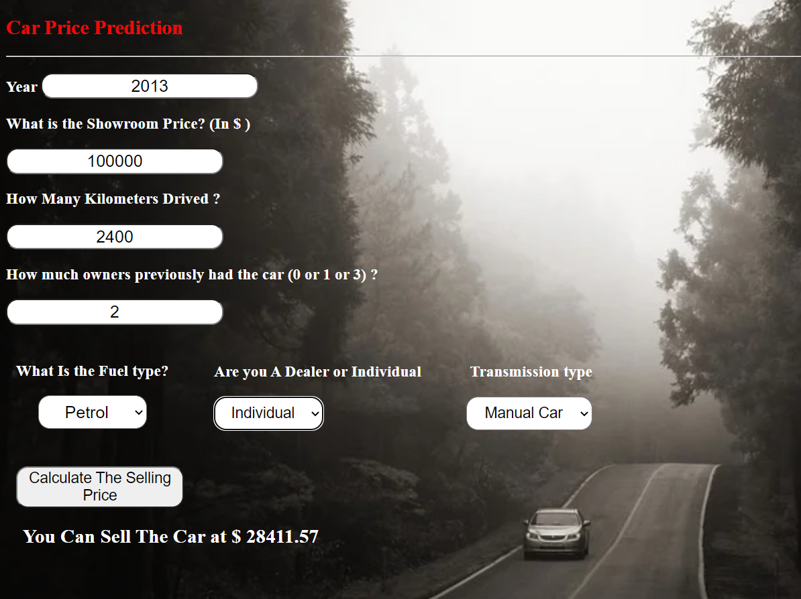

# car price prediction

## Description:

This project aims to predict the price of a used car by taking the year of purchase, what is the showroom price,how many Kilometers drived,how much owners previously had the car,what is the Fuel type (Petrol,Diesel or CNG), the buyer (A Dealer or Individual) and finally The Transmission type (Manual car or Automatic car).

Data from [Source](https://www.kaggle.com/nehalbirla/vehicle-dataset-from-cardekho) (This dataset contains information about used cars.)

The image below is an example:

## This is the project link: [car price prediction](https://car--priceprediction.herokuapp.com/)

## Steps To Do:
1 - Clone the repository

2 - Install the required packages in "requirements.txt" file.

#### Packages : 
* matplotlib 
* numpy 
* pandas 
* requests 
* seaborn 
* scikit-learn
* Flask  (For Web Development)

3 - Run the "price.py" file 
